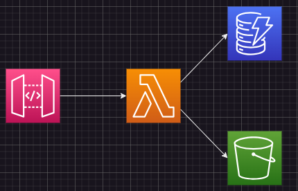
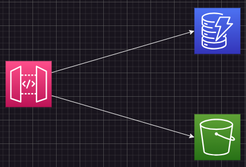

# AWS統合を活用して無駄なLambdaを減らす
## Lambdaを使用する場合
AWSのAPI Gatewayを使用している場合、S3やDynamoDBの操作をする際があると思います  
おそらく、すぐに思いつくのは以下のような構成かと思います  
  
LambdaでS3やDynamoDBを操作する構成ですね  
ただ、Lambdaがいると単体テストが必要になってきます  
DynamoDBを少しだけ操作するだけなのに、コードと単体テストの両方が必要となってきます  
しかも、CloudFormation化するなら、更にテンプレートファイルの作成まで必要となってきて、結構面倒です
## AWS統合
そこで、オススメなのがAWS統合です  
### AWS統合
Lambdaを経由せずAPI Gatewayから直接、S3やDynamoDBなどのAWSサービスを操作する方法です  
[AWS 統合を使用して API Gateway REST API を構築する](https://docs.aws.amazon.com/ja_jp/apigateway/latest/developerguide/getting-started-aws-proxy.html)  
※本来はAWS統合とは言わないかもで注意です  
### 何がいいのか?
まず、構成が以下ようになり、Lambdaがなくなります  
  
Lambdaがなくなるので、コードの作成とUTもなくなります  
よって、CloudFormationのテンプレートファイルだけ書けば良くなるのです  
### ハンズオン
実際にAWS統合でDynamoDBにデータを格納したり取得するCloudFormationのテンプレートファイルを書いてみます  
※SAM形式で記載します  
テンプレートファイルには以下のリソースを定義します  
- API Gateway(REST API)
- API GatewayのIAM Role(API Gateway自体に各リソースにアクセスできるようにするため)
- DynamoDB(API Gatewayの操作対象)

#### テンプレートファイル
```
AWSTemplateFormatVersion: "2010-09-09"
Description: "AWS Integration Practice"
Transform: AWS::Serverless-2016-10-31
Parameters:
  ApplicationName:
    Type: String
    Default: aws-integration-practice

Resources:
  DynamoDB:
    Type: AWS::DynamoDB::Table
    Properties:
      TableName: !Ref ApplicationName
      ProvisionedThroughput: 
        ReadCapacityUnits: 5
        WriteCapacityUnits: 5
      AttributeDefinitions:
        - AttributeName: 'userId'
          AttributeType: 'S'
      KeySchema:
        - AttributeName: 'userId'
          KeyType: 'HASH'

  ApiGatewayRole:
    Type: AWS::IAM::Role
    Properties:
      RoleName: !Sub ${ApplicationName}-apigateway
      Description: aws integration
      AssumeRolePolicyDocument:
        Version: '2012-10-17'
        Statement:
          - Effect: Allow
            Action: sts:AssumeRole
            Principal:
              Service:
                - apigateway.amazonaws.com
      ManagedPolicyArns:
        - arn:aws:iam::aws:policy/AmazonDynamoDBFullAccess

  ApiGatewayLogRole:
    Type: AWS::IAM::Role
    Properties:
      RoleName: !Sub ${ApplicationName}-apigateway-log
      Description: aws integration
      AssumeRolePolicyDocument:
        Version: '2012-10-17'
        Statement:
          - Effect: Allow
            Action: sts:AssumeRole
            Principal:
              Service:
                - apigateway.amazonaws.com
      ManagedPolicyArns:
        - arn:aws:iam::aws:policy/service-role/AmazonAPIGatewayPushToCloudWatchLogs

  ApiGatewayLogSetting:
    Type: AWS::ApiGateway::Account
    Properties:
      CloudWatchRoleArn: !GetAtt ApiGatewayLogRole.Arn


  ApiGateway:
    Type: AWS::Serverless::Api
    Properties:
      Name: !Ref ApplicationName
      Description: AWS統合練習
      StageName: test
      DefinitionBody:
        openapi: 3.0.1
        info:
          title: !Sub ${ApplicationName} API
          version: '1.0.0'
        paths:
          /user:
            post:
              description: 'ユーザー情報登録'
              requestBody:
                content:
                  application/json:
                    schema:
                      title: RegisterUserRequestBody
                      type: object
                      properties:
                        userId:
                          type: string
                        name:
                          type: string
                        age:
                          type: number
              responses:
                '200':
                  description: OK
              x-amazon-apigateway-integration:
                type: aws
                httpMethod: POST
                credentials: !GetAtt ApiGatewayRole.Arn
                uri: !Sub arn:aws:apigateway:${AWS::Region}:dynamodb:action/PutItem
                integrationHttpMethod: POST
                passthroughBehavior: when_no_templates
                responses:
                  default:
                    statusCode: 200
                requestTemplates:
                  application/json: !Sub |
                    #set($inputRoot = $input.path('$'))
                    {
                      "TableName": "${DynamoDB}",
                      "Item": {
                        "userId": {
                          "S": "$inputRoot.userId"
                        },
                        "name": {
                          "S": "$inputRoot.name"
                        },
                        "age": {
                          "N": "$inputRoot.age"
                        }
                      }
                    }
          /user/{userId}:
            get:
              description: 'ユーザー情報取得'
              parameters:
                - name: userId
                  in: path
                  description: ユーザー名
                  type: string
              responses:
                '200':
                  description: Successful response
                  content:
                    application/json:
                      schema:
                        title: GetUserResponseSuccess
                        type: object
                        properties:
                          name:
                            type: string
                            description: 名前
                          age:
                            type: number
                            description: 年齢
              x-amazon-apigateway-integration:
                type: aws
                httpMethod: POST
                credentials: !GetAtt ApiGatewayRole.Arn
                uri: !Sub arn:aws:apigateway:${AWS::Region}:dynamodb:action/GetItem
                integrationHttpMethod: POST
                passthroughBehavior: when_no_templates
                requestParameters:
                  integration.request.path.userId: method.request.path.userId
                requestTemplates:
                  application/json: !Sub |
                    {
                      "TableName": "${DynamoDB}",
                      "Key": {
                        "userId":{
                          "S": "$input.params('userId')"
                        }
                      }
                    }
                responses:
                  '200':
                    statusCode: '200'
                    responseTemplates:
                      application/json: |
                        {
                            "name": "$input.path('$').Item.name.S",
                            "age": "$input.path('$').Item.age.N"
                        }
```

### ハマった箇所
GetItemコマンドはHTTP Methodとしては**POST**らしいです  
ずっとGETで定義していて、レスポンスが返ってこず悩んでました  

### 改良点
DefinitionBodyで定義すると見ずらい&書きずらいので以下のリソースで小分けにした方がいいかもですね  
- [AWS::ApiGateway::Resource](https://docs.aws.amazon.com/ja_jp/AWSCloudFormation/latest/UserGuide/aws-resource-apigateway-resource.html)
- [AWS::ApiGateway::Method](https://docs.aws.amazon.com/ja_jp/AWSCloudFormation/latest/UserGuide/aws-resource-apigateway-method.html)