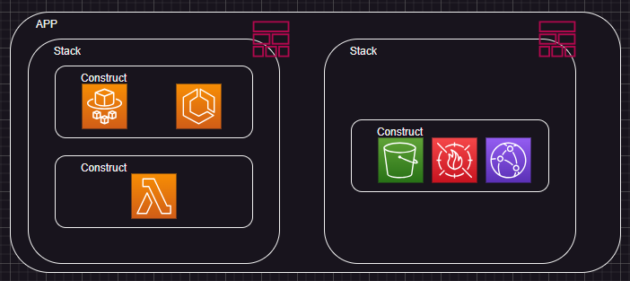
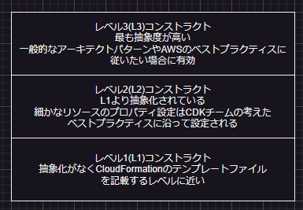

# コアフレーム
APP->Stack->Constructの要素で構成される  
  
## APP
- コンポーネントの最上位要素
- 複数スタックの依存関係を定義
## Stack
- CloudFormationのStack
## Construct
- 1つ以上からなるAWSリソース
- ユーザーにより定義・配布が可能

# コンストラクトレベル
3つのレベルに分類される  
抽象化のレベルが高いほど段階的に上がっていく  
抽象度が低いほど自由な設定はできるが記述量が多くなり、多くの専門知識が必要になる  
  
## L1 コンストラクト
- 最も基本的なコンストラクトであり、AWS CloudFormation リソースタイプに直接マッピングされる
- CloudFormation リソースとの 1 対 1 の関係がある
- すべてのリソースプロパティを手動で指定する必要がある
- `Cfn` プレフィックスで命名される (例: S3 バケットの場合は CfnBucket)。
- リソース構成を細かく制御する必要がある上級ユーザーに最適

## L2 コンストラクト
- L1 コンストラクトよりも高いレベルの抽象化を提供する
- 1 つ以上の L1 コンストラクトをラップし、適切なデフォルト値と便利なメソッドを提供する
- 一般的な構成パターンを処理することで、リソースの作成を簡素化する
- 使用性と定型コードの削減を向上させるための追加ロジックが含まれることがよくある
- 例には、S3 の Bucket クラスや Lambda の Function クラスなどがある

## L3 コンストラクト
- "パターン" とも呼ばれ、CDK で最も高いレベルの抽象化
- 複数の L2 および L1 コンストラクトを組み合わせて、一般的なアーキテクチャパターン向けの完全なソリューションを作成する
- ベストプラクティスと一般的なシナリオを迅速に実装できるように設計されている
- 例には、コンテナ化されたアプリケーション用の ApplicationLoadBalancedFargateService や、サーバーレス API 用の LambdaRestApi などがある

# CDK実行手順【初回】
以下の条件が前提  
- AWS CLIがダウンロードされており、初期設定が完了していること
- npmがinstallされているが前提  
##  CDKのインストール
1. CDKをインストール  
```
npm install -g aws-cdk
```
  
2. CDKのバージョン確認  
```
cdk --version
```
  
## テンプレートの作成
1. initアクションの実施  
```
cdk init sample-app --language typescript
```
  
各ファイルの役割  
- 隠しサブディレクトリ .git と隠しファイル .gitignore。これにより、プロジェクトは Git などのソース管理ツールと互換性を持ちます。
- lib サブディレクトリ。hello-cdk-stack.ts ファイルが含まれます。このファイルには、AWS CDK スタック用のコードが含まれます。このコードは、この手順の次のステップで説明します。
- bin サブディレクトリ。hello-cdk.ts ファイルが含まれます。このファイルには、AWS CDK アプリケーション用のエントリポイントが含まれます。
- node_modules サブディレクトリ。必要に応じてアプリケーションとスタックで使用できるサポート用のコードパッケージが含まれます。
- 隠しファイル .npmignore。コードのビルド時に npm で使用しない種類のサブディレクトリやファイルのリストが含まれます。
- cdk.json ファイル。このファイルの情報を使用すると cdk コマンドを実行しやすくなります。
- package-lock.json ファイル。このファイルの情報を使用して、npm はビルドや実行に伴うエラーを減らすことができます。
- package.json ファイル。このファイルの情報を使用すると、npm コマンドの実行が容易になり、ビルドと実行に伴うエラーも減る可能性があります。
- README.md ファイル。npm と AWS CDK で実行できる便利なコマンドのリストがあります。
- tsconfig.json ファイル。このファイルの情報を使用すると、tsc コマンドの実行が容易になり、ビルドと実行に伴うエラーも減る可能性があります。

## deploy
1. initアクションで実行したフォルダのルートに移動して以下のコマンドを実行  
```
cdk synth
```
  
2. 初めてCDKを実行する場合は以下のコマンドを実行
```
cdk bootstrap
```
  
3. 以下のコマンドを実行  
```
cdk deploy
```

# 参考サイト
- [AWS Cloud9のチュートリアル](https://docs.aws.amazon.com/ja_jp/cloud9/latest/user-guide/sample-cdk.html)
- [手元の Windows 11 端末に AWS CLI をインストールして AWS CLI コマンドを実行する](https://dev.classmethod.jp/articles/install-aws-cli-on-the-windows-11-terminal-at-hand-and-execute-aws-cli-commands/)
- [cdk コマンドの機能を 実際に叩いて理解する](https://dev.classmethod.jp/articles/aws-cdk-command-line-interface/)
- [実践！AWS CDK #1 導入](https://dev.classmethod.jp/articles/cdk-practice-1-introduction/)