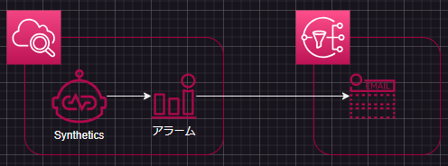
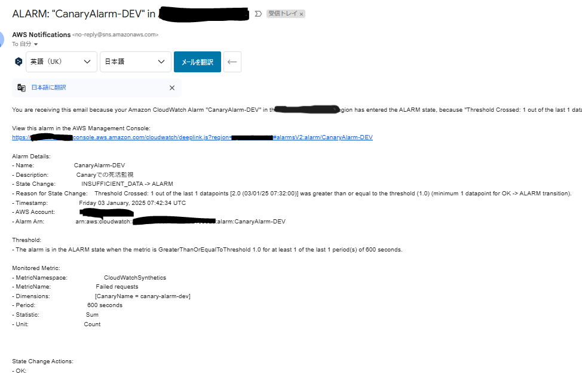

# やりたいこと
AWSで死活監視をしたいことがあると思います  
今回はUIの死活監視を構築してみたいと思います  

# 構成
1. CloudWatch Synthetics Canaryで指定のURLの死活監視を設定
2. 200以外のステータスであればCloudWatch Alarmが作動
3. 指定のmailアドレスに通知
  
  

# 条件
- Canary用のLambdaはVPC設定なし
- スクリーンショットは取らない
- Canaryのコードはtemplateファイルに直書き

# CloudFormationテンプレート
```
AWSTemplateFormatVersion: "2010-09-09"
Description: "CloudWatch Synthetics Canary and Alarm, SNS Tamplte"
Parameters:
  ProjectName:
    Type: String
    Default: "CanaryAlarm"
  EnvNameUpper:
    Type: String
    Default: "DEV"
    AllowedValues:
      - "DEV"
      - "STG"
      - "PROD"
  EnvNameLower:
    Type: String
    Default: "dev"
    AllowedValues:
      - "dev"
      - "stg"
      - "prod"
  MailAddress:
    Type: String
    Description: Email for notifications
  TargetUrl:
    Type: String
    Description: Canary Target URL
  CanaryExecutionCycleMinutes:
    Type: String
    Default: "10"

Resources:
# Canaryの結果保存用のS3バケット
  CanaryBucket:
    Type: AWS::S3::Bucket
    Properties:
      BucketName: !Sub canary-alarm-${EnvNameLower}
      PublicAccessBlockConfiguration:
        BlockPublicAcls: true
        BlockPublicPolicy: true
        IgnorePublicAcls: true
        RestrictPublicBuckets: true

# CanaryのIAMRole
  CanaryIamRole:
    Type: AWS::IAM::Role
    Properties:
      AssumeRolePolicyDocument:
        Version: "2012-10-17"
        Statement:
          - Effect: Allow
            Principal:
              Service: lambda.amazonaws.com
            Action: "sts:AssumeRole"
      Policies:
        - PolicyName: !Sub CanaryPolicy-${EnvNameUpper}
          PolicyDocument:
            Version: "2012-10-17"
            Statement:
              - Effect: Allow
                Action:
                  - logs:CreateLogStream
                  - logs:PutLogEvents
                  - logs:CreateLogGroup
                Resource:
                  - !Sub arn:aws:logs:${AWS::Region}:${AWS::AccountId}:log-group:/aws/lambda/${ProjectName}-cwsyn-*
              - Effect: Allow
                Resource: "*"
                Action: cloudwatch:PutMetricData
                Condition:
                  StringEquals:
                    cloudwatch:namespace: CloudWatchSynthetics
      # NOTE: 本来は良くないが時間短縮のため設定
      ManagedPolicyArns:
        - arn:aws:iam::aws:policy/AmazonS3FullAccess

# Canary本体
  Canary:
    Type: AWS::Synthetics::Canary
    Properties:
      Name: !Sub canary-alarm-${EnvNameLower}
      ExecutionRoleArn: !GetAtt CanaryIamRole.Arn
      ArtifactS3Location: !Sub s3://${CanaryBucket}
      ProvisionedResourceCleanup: AUTOMATIC
      RunConfig: 
        MemoryInMB: 960
        TimeoutInSeconds: 300
      RuntimeVersion: syn-nodejs-puppeteer-9.1
      StartCanaryAfterCreation: true
      Schedule:
        Expression: !Sub rate(${CanaryExecutionCycleMinutes} minutes)
      Code: 
        Handler: pageLoadBlueprint.handler
        Script: !Sub |
          const { URL } = require('url');
          const synthetics = require('Synthetics');
          const log = require('SyntheticsLogger');
          const syntheticsConfiguration = synthetics.getConfiguration();
          const syntheticsLogHelper = require('SyntheticsLogHelper');

          const loadBlueprint = async function () {
            syntheticsConfiguration.disableStepScreenshots();
            syntheticsConfiguration.setConfig({
              continueOnStepFailure: true,
              includeRequestHeaders: true, // Enable if headers should be displayed in HAR
              includeResponseHeaders: true, // Enable if headers should be displayed in HAR
              restrictedHeaders: [], // Value of these headers will be redacted from logs and reports
              restrictedUrlParameters: [] // Values of these url parameters will be redacted from logs and reports
            });

            try {
              let page = await synthetics.getPage();
              const response = await page.goto("${TargetUrl}", { waitUntil: ['domcontentloaded'], timeout: 30000});
              if (response !== 200) throw new Error("Page Load Fail");
            } catch (err) {
              console.log(err);
              throw err;
            }
          }

          exports.handler = async () => {
            return await loadBlueprint();
          };

# Canary用のアラーム
  CanaryAlarm:
    Type: AWS::CloudWatch::Alarm
    Properties:
      AlarmName: !Sub ${ProjectName}-${EnvNameUpper}
      MetricName: Failed requests
      AlarmDescription: !Sub Canaryでの死活監視
      Namespace: CloudWatchSynthetics
      ActionsEnabled: True
      Dimensions: 
        - Name: CanaryName
          Value: !Ref Canary
      AlarmActions: 
        - !Ref CanaryAlarmSNSTopic
      ComparisonOperator: GreaterThanOrEqualToThreshold
      DatapointsToAlarm: 1
      EvaluationPeriods: 1
      Period: 600
      Statistic: Sum
      Threshold: 1
      Unit: Count

#SNSトピック作成
  CanaryAlarmSNSTopic:
    Type: AWS::SNS::Topic
    Properties:
      TopicName: !Sub ${ProjectName}-Canary-Alarm-SNS-Topic-${EnvNameUpper}

#サブスクリプション設定
  CanaryAlarmSubscription:
    Type: AWS::SNS::Subscription
    Properties:
      TopicArn: !Ref CanaryAlarmSNSTopic
      Endpoint: !Ref MailAddress
      Protocol: email
```

# 結果
URLを適当に設定してテンプレートを実行したところ、指定したメールアドレスにメールが届いていることを確認できました  
  

# 参考サイト
- [Canary によって発行される CloudWatch メトリクス](https://docs.aws.amazon.com/ja_jp/AmazonCloudWatch/latest/monitoring/CloudWatch_Synthetics_Canaries_metrics.html)
- [AWS CloudWatch Synthetics Monitoring を CloudFormation で設定する](https://qiita.com/yh1224/items/2f29bb571958182c9913)
- [Black Belt](https://pages.awscloud.com/rs/112-TZM-766/images/AWS-Black-Belt_2023_Amazon-CloudWatch-Synthetics_0331_v1.pdf)