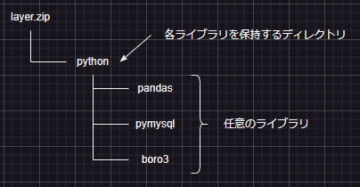

# ハマったポイント
## lambda-layerの作成
pythonでlayerを作成するときは以下の構成となるらしい  
  
作り方をまとめると以下の手順になる
1. 任意のディレクトリ内にpythonディレクトリを作成する
2. pythonディレクトリに必要なライブラリをインストールする
```
pip install boto3 -t python
```
3. pythonディレクトリをzip化
```
zip -r layer.zip ./python
```
4. 手順3でzip化したものをlayerとして登録する