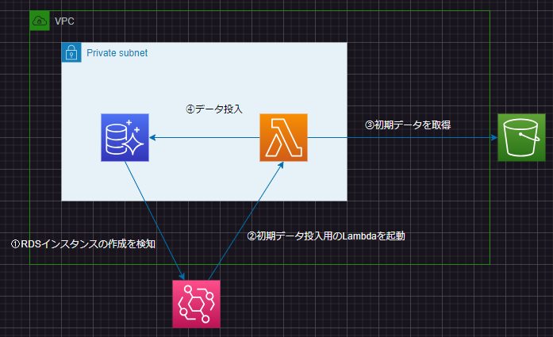

CloudFormationでRDSに初期データを投入する方法  
アプリケーションの起動時に**自動的**にRDSに初期データを入れたい場合があると思います  
やり方は複数あると思いますが、今回はLambdaで実装していきます  
また、CloudFormation化して全自動で初期データを投入する方法です  
# 構成や条件
## 構成
以下の構成と初期プロセスをCloudFormationで自動化  
  
## 条件
- Aurora MySQL
- Lambdaで初期データ投入
- RDSインスタンスの起動を条件にEventBridgeでデータ投入用のLambdaを起動
- Lambda LayerはS3のrds-initバケットにrds-layer.zipとして保存
- Lambdaのソースコードはrds-initバケットにlambda.zipとして保存
- 初期データはrds-initバケットにinit_data.jsonとして保存
- RDS操作にはpymysqlを使用
- S3の操作にはboto3を使用

# ハンズオン
## Lambda ファイル
### S3を操作するモジュール
storage.py  
```
import json
import boto3

s3 = boto3.client('s3')

def read_rds_init_data(bucket, object_key, application_name, table_name):
    response = s3.get_object(Bucket=bucket, Key=object_key)
    body = response['Body'].read()
    data = json.loads(body.decode('utf-8'))
    init_data = data[application_name][table_name]
    return init_data

```
### main
lambda_rds_init_process.py
```
# 標準モジュール
import sys
import logging
import os
from typing import Final
import uuid

# 自作モジュール
from storage import read_rds_init_data

# 外部ライブラリ
import pymysql

logger = logging.getLogger()
logger.setLevel(logging.DEBUG)

# DBの設定条件
DB_HOST: Final[str] = os.environ['DB_HOST']
DB_USER_NAME: Final[str] = os.environ['DB_USER_NAME']
DB_PASSWORD: Final[str] = os.environ['DB_PASSWORD']
DB_NAME: Final[str] = os.environ['DB_NAME']
DB_PORT: Final[int] = os.environ['DB_PORT']

logger.info('RDS Init Process Start')

# DBとのセッションを確立する
try:
    conn = pymysql.connect(host=DB_HOST, user=DB_USER_NAME, passwd=DB_PASSWORD, db=DB_NAME, connect_timeout=5)
except pymysql.MySQLError as e:
    print(e)
    sys.exit(1)

def handler(event, context):
    bucket = event['bucket_name']
    object_key = event['object_key']
    application_name = event['application_name']
    table_name = event['table_name']
    
    with conn.cursor() as cursor:
        create_table_sql: str = "CREATE TABLE IF NOT EXISTS users(`id` varchar(256) PRIMARY KEY,`name` varchar(256) NOT NULL,`age` TINYINT NOT NULL, `mail_address` varchar(256) NOT NULL)"
        cursor.execute(create_table_sql)

        init_data = read_rds_init_data(bucket=bucket, object_key=object_key, application_name=application_name, table_name=table_name)
        for data in init_data:
            logger.debug(f'insert data: {data}')
            id = uuid.uuid1()
            name = data['name']
            age = data['age']
            mail_address = data['mail_address']
            insert_sql: str = f"INSERT INTO users(id, name, age, mail_address) VALUES (%s, %s, %s, %s)"
            cursor.execute(insert_sql, (id, name, age, mail_address))
            conn.commit()

        select_sql: str = "SELECT * FROM users"
        cursor.execute(select_sql)
        logger.debug('check inserted data')
        for row in cursor:
            print(row)

logger.info('RDS Init Process End')

```
## 投入するデータ
init_data.json  
```
{
    "import-data-from-s3": {
        "users": [
            {"name": "Tom", "age": 25, "mail_address": "tom@test.com"},
            {"name": "Dency", "age": 49, "mail_address": "dency@example.com"}
        ]
    }
}
```
## テンプレートファイル
:::note warn
注意点
実際に使用する場合はDBのUserName, Passwordはテンプレートへの直書きはよろしくないです  
パラメータストアやシークレットマネージャに保管して参照するようにしてください  
:::
  
```
AWSTemplateFormatVersion: "2010-09-09"
Description: "RDS Import Data by Lambda via S3 Stack"
Parameters:
  ApplicationName:
    Type: String
    Default: 'import-data-from-s3'
  VpcCidr:
    Type: String
    Default: '10.1.0.0/16'
  PublicSubnetCidr1:
    Type: String
    Default: '10.1.10.0/24'
  PublicSubnetCidr2:
    Type: String
    Default: '10.1.20.0/24'
  PrivateSubnetCidr1:
    Type: String
    Default: '10.1.100.0/24'
  PrivateSubnetCidr2:
    Type: String
    Default: '10.1.200.0/24'
  MasterUsername:
    Type: String
    Default: RootUserName
  MasterUserPassword:
    Type: String
    Default: RootPassword
  DbPort:
    Type: Number
    Default: 3306
  S3Bucket:
    Type: String
    Default: rds-init

# ------------------------------------------------------------#
# Mappings
# ------------------------------------------------------------#  
Mappings:
  Constant:
    RDS:
      DatabaseName: auroradb
      InstanceClass: db.t4g.medium

Resources:
# ------------------------------------------------------------#
#  VPC
# ------------------------------------------------------------#  
  VPC:
    Type: AWS::EC2::VPC
    Properties:
      CidrBlock: !Ref VpcCidr
      EnableDnsHostnames: "true"
      EnableDnsSupport: "true"
      InstanceTenancy: "default"
  InternetGateway: 
    Type: AWS::EC2::InternetGateway
  InternetGatewayAttachment:
    Type: AWS::EC2::VPCGatewayAttachment
    Properties: 
      InternetGatewayId: !Ref InternetGateway
      VpcId: !Ref VPC
# ------------------------------------------------------------#
#  Subnet
# ------------------------------------------------------------#  
  PublicSubnet1:
    Type: AWS::EC2::Subnet
    Properties: 
      CidrBlock: !Ref PublicSubnetCidr1
      VpcId: !Ref VPC
      AvailabilityZone: !Select 
        - 0
        - Fn::GetAZs: !Ref "AWS::Region"
  PublicSubnet2:
    Type: AWS::EC2::Subnet
    Properties: 
      CidrBlock: !Ref PublicSubnetCidr2
      VpcId: !Ref VPC
      AvailabilityZone: !Select
        - 1
        - Fn::GetAZs: !Ref "AWS::Region"
  PrivateSubnet1:
    Type: AWS::EC2::Subnet
    Properties: 
      CidrBlock: !Ref PrivateSubnetCidr1
      VpcId: !Ref VPC
      AvailabilityZone: !Select
        - 0
        - Fn::GetAZs: !Ref "AWS::Region"
  PrivateSubnet2:
    Type: AWS::EC2::Subnet
    Properties: 
      CidrBlock: !Ref PrivateSubnetCidr2
      VpcId: !Ref VPC
      AvailabilityZone: !Select
        - 1
        - Fn::GetAZs: !Ref "AWS::Region"
# ------------------------------------------------------------#
#  RouteTable
# ------------------------------------------------------------#  
  PublicRouteTable:
    Type: AWS::EC2::RouteTable
    Properties:
      VpcId: !Ref VPC
  PrivateRouteTable:
    Type: AWS::EC2::RouteTable
    Properties:
      VpcId: !Ref VPC
# ------------------------------------------------------------#
# Routing
# ------------------------------------------------------------# 
  PublicRoute: 
    Type: AWS::EC2::Route
    Properties: 
      RouteTableId: !Ref PublicRouteTable
      DestinationCidrBlock: "0.0.0.0/0"
      GatewayId: !Ref InternetGateway
# ------------------------------------------------------------#
# S3 EndPoint
# ------------------------------------------------------------# 
  S3VpcEndPoint:
    Type: AWS::EC2::VPCEndpoint
    Properties:
      ServiceName: !Sub "com.amazonaws.${AWS::Region}.s3"
      VpcId: !Ref VPC
      VpcEndpointType: "Gateway"
      PrivateDnsEnabled: "false"
      RouteTableIds:
        - !Ref PrivateRouteTable
# ------------------------------------------------------------#
# RouteTable Associate
# ------------------------------------------------------------# 
  PublicSubnetRouteTableAssociation1: 
    Type: AWS::EC2::SubnetRouteTableAssociation
    Properties: 
      SubnetId: !Ref PublicSubnet1
      RouteTableId: !Ref PublicRouteTable
  PublicSubnetRouteTableAssociation2:
    Type: AWS::EC2::SubnetRouteTableAssociation
    Properties: 
      SubnetId: !Ref PublicSubnet2
      RouteTableId: !Ref PublicRouteTable
  PrivateSubnetRouteTableAssociation1:
    Type: AWS::EC2::SubnetRouteTableAssociation
    Properties: 
      SubnetId: !Ref PrivateSubnet1
      RouteTableId: !Ref PrivateRouteTable
  PrivateSubnetRouteTableAssociation2:
    Type: AWS::EC2::SubnetRouteTableAssociation
    Properties: 
      SubnetId: !Ref PrivateSubnet2
      RouteTableId: !Ref PrivateRouteTable
# ------------------------------------------------------------#
# Lambda Secrity Group
# ------------------------------------------------------------#
  LambdaSecurityGroup:
    Type: AWS::EC2::SecurityGroup
    Properties:
      VpcId: !Ref VPC
      GroupName: Lambda-sg
      GroupDescription: Lambda Secrity Group
      SecurityGroupIngress:
        - CidrIp: 0.0.0.0/0
          IpProtocol: -1
# ------------------------------------------------------------#
# RDS Secrity Group
# ------------------------------------------------------------#
  RdsSecurityGroup:
    Type: AWS::EC2::SecurityGroup
    Properties:
      VpcId: !Ref VPC
      GroupName: Rds-sg
      GroupDescription: RDS Secrity Group
      SecurityGroupIngress:
        - IpProtocol: "tcp"
          FromPort: !Ref DbPort
          ToPort: !Ref DbPort
          SourceSecurityGroupId: !Ref LambdaSecurityGroup
# ------------------------------------------------------------#
# S3 Access IAM Role
# ------------------------------------------------------------#
  AuroraS3AccessRole:
    Type: AWS::IAM::Role
    Properties:
      RoleName: !Sub ${ApplicationName}-DB-Access-S3
      AssumeRolePolicyDocument:
        Version: '2012-10-17'
        Statement:
          - Effect: Allow
            Principal:
              Service: rds.amazonaws.com
            Action: sts:AssumeRole
      ManagedPolicyArns:
        - arn:aws:iam::aws:policy/AmazonS3FullAccess
# ------------------------------------------------------------#
# DBSubnetGroup
# ------------------------------------------------------------#
  DBSubnetGroup:
    Type: AWS::RDS::DBSubnetGroup
    Properties:
      DBSubnetGroupDescription: !Sub ${ApplicationName} DB Subnet Group
      DBSubnetGroupName: !Sub ${ApplicationName}
      SubnetIds: 
        - !Ref PrivateSubnet1
        - !Ref PrivateSubnet2
# ------------------------------------------------------------#
# DB Cluster Parameter Group
# ------------------------------------------------------------#
  DBClusterParameterGroup:
    Type: AWS::RDS::DBClusterParameterGroup
    Properties:
      DBClusterParameterGroupName: !Sub ${ApplicationName}-DbClusterParamGroup
      Description: !Sub ${ApplicationName} DbClusterParamGroup
      Family: aurora-mysql8.0
      Parameters:
        time_zone: 'Asia/Tokyo'
        aws_default_s3_role: !GetAtt AuroraS3AccessRole.Arn
# ------------------------------------------------------------#
# DB Cluster
# ------------------------------------------------------------#
  DBCluster:
    Type: AWS::RDS::DBCluster
    Properties:
      DatabaseName: !FindInMap [Constant, RDS, DatabaseName]
      AssociatedRoles:
        - RoleArn: !GetAtt AuroraS3AccessRole.Arn
      AvailabilityZones:
        - !Sub ${AWS::Region}c
        - !Sub ${AWS::Region}a
      DBSubnetGroupName: !Ref DBSubnetGroup
      Engine: aurora-mysql
      EngineMode: provisioned
      EngineVersion: '8.0'
      Port: !Ref DbPort
      DBClusterIdentifier: !Sub ${ApplicationName}-data-base-cluster
      DBClusterParameterGroupName: !Ref DBClusterParameterGroup
      MasterUsername: !Ref MasterUsername
      MasterUserPassword: !Ref MasterUserPassword
      StorageEncrypted: true
      VpcSecurityGroupIds:
        - !Ref RdsSecurityGroup
# ------------------------------------------------------------#
# DB Instance
# ------------------------------------------------------------#
  DBInstance:
    Type: AWS::RDS::DBInstance
    DependsOn: DBCluster
    Properties:
      DBSubnetGroupName: !Ref DBSubnetGroup
      DBInstanceClass: !FindInMap [Constant, RDS, InstanceClass]
      DBClusterIdentifier: !Ref DBCluster
      Engine: aurora-mysql
      EngineVersion: '8.0'
      DBInstanceIdentifier: !Sub ${ApplicationName}-data-base-instance
# ------------------------------------------------------------#
# Lambda Role
# ------------------------------------------------------------#
  LambdaRole:
    Type: AWS::IAM::Role
    Properties:
      RoleName: !Sub "${ApplicationName}-lambda"
      AssumeRolePolicyDocument:
        Version: "2012-10-17"
        Statement:
          - Effect: Allow
            Action: sts:AssumeRole
            Principal:
              Service: lambda.amazonaws.com
      ManagedPolicyArns:
        - arn:aws:iam::aws:policy/AmazonS3FullAccess
        - arn:aws:iam::aws:policy/AmazonRDSFullAccess
        - arn:aws:iam::aws:policy/service-role/AWSLambdaBasicExecutionRole
        - arn:aws:iam::aws:policy/service-role/AWSLambdaSQSQueueExecutionRole
        - arn:aws:iam::aws:policy/service-role/AWSLambdaVPCAccessExecutionRole
# ------------------------------------------------------------#
# Lambda Layer
# ------------------------------------------------------------#
  LambdaLayer:
    Type: AWS::Lambda::LayerVersion
    Properties:
      LayerName: !Sub ${ApplicationName}-Layer
      Description: !Sub ${ApplicationName} Lambda Layer
      CompatibleArchitectures: 
        - arm64
      CompatibleRuntimes: 
        - python3.10
      Content: 
        S3Bucket: !Ref S3Bucket
        S3Key: rds-layer.zip
# ------------------------------------------------------------#
# Lambda
# ------------------------------------------------------------#
  Lambda:
    Type: AWS::Lambda::Function
    Properties:
      Description: RDS初期プロセス
      FunctionName: rds-init-process
      Role: !GetAtt LambdaRole.Arn
      Handler: lambda_rds_init_process.handler
      Architectures:
        - arm64
      Runtime: python3.10
      MemorySize: 256
      Timeout: 600
      Layers: 
        - !Ref LambdaLayer
      VpcConfig:
        Ipv6AllowedForDualStack: false
        SubnetIds:
          - !Ref PrivateSubnet1
          - !Ref PrivateSubnet2
        SecurityGroupIds:
          - !Ref LambdaSecurityGroup
      Environment:
        Variables:
          DB_HOST: !GetAtt DBCluster.Endpoint.Address
          DB_USER_NAME: !Ref MasterUsername
          DB_PASSWORD: !Ref MasterUserPassword
          DB_NAME: !FindInMap [Constant, RDS, DatabaseName]
          DB_PORT: !Ref DbPort
      Code:
        S3Bucket: !Ref S3Bucket
        S3Key: lambda.zip
# ------------------------------------------------------------#
# Event Bridge IAM Role
# ------------------------------------------------------------#
  EventBridgeRole:
    Type: AWS::IAM::Role
    Properties:
      RoleName: !Sub "${ApplicationName}-event-bridge"
      AssumeRolePolicyDocument:
        Version: "2012-10-17"
        Statement:
          - Effect: Allow
            Action: sts:AssumeRole
            Principal:
              Service: events.amazonaws.com
      ManagedPolicyArns:
        - arn:aws:iam::aws:policy/AWSLambda_FullAccess
# ------------------------------------------------------------#
# RDS Init Process Rule
# ------------------------------------------------------------#
  RdsStartRule:
    Type: AWS::Events::Rule
    Properties:
      Name: !Sub ${ApplicationName}
      Description: RDS Init Process
      RoleArn: !GetAtt EventBridgeRole.Arn
      State: ENABLED
      EventPattern:
        source:
          - aws.rds
        detail-type:
          - DS DB Instance Event
        detail.EventID:
          - RDS-EVENT-0005
      Targets: 
        - 
          Arn: !GetAtt Lambda.Arn
          Id: TempId123
          Input: !Sub |
            {
              "bucket_name": "${S3Bucket}",
              "object_key": "init_data.json",
              "application_name": "${ApplicationName}",
              "table_name": "users"
            }
# ------------------------------------------------------------#
# Lambda RDS Init Process Permission
# ------------------------------------------------------------#
  PermissionForEventsToInvokeLambda: 
    Type: AWS::Lambda::Permission
    Properties: 
      FunctionName: !Ref Lambda
      Action: lambda:InvokeFunction
      Principal: events.amazonaws.com
      SourceArn: !GetAtt RdsStartRule.Arn
```

## 実行結果
lambdaのログを確認するとRDSに初期値が入っていることが確認できました  
  


# 他の初期データ投入方法の記事
- [Amazon RDS DB インスタンスにデータをインポートする方法を教えてください。](https://repost.aws/ja/knowledge-center/rds-import-data)
- [CloudFormationからLambdaを実行してテーブル情報の入ったRDSを自動作成](https://qiita.com/jimbot3/items/1fcf0be595958e6e6ae8)