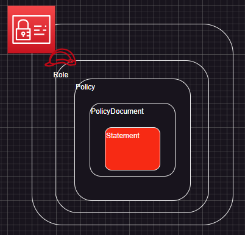
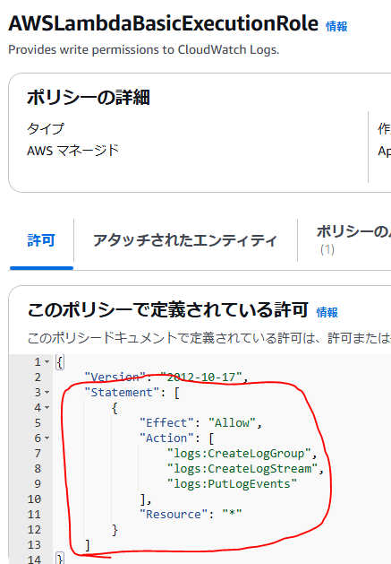

# 概要
AWSを使う上で絶対に切っても切れないのがIdentity and Access Management(以降、IAMと記載)  
今回はCDK, CloudFormationでIAM Role, Policyを作る際に出てくるStatementの部分を可能な限り解説しています  

# 記事の対象者
- IAMについて勉強したい人(初心者レベル)
- Statementの各項目について忘れてしまった人
- CDK, CloudFormationでIAM系を作る人

# 本題
## Statementの立ち位置
解説対象のStatementはIAMにおいて、どの立ち位置にいるのかを整理します  
図で表すと↓の赤色部分になります  
  
実際のIAM Policyだと赤丸の部分になります  
  

## Statementの要素
Statementには以下の要素が存在します  
*が付いている要素は必須
- Effect*
- Action*
- Resource*
- Condition
- Principal
- Sid

### Effect
実行を許可するか拒否するかを記述する
#### 記述例
Allow or Deny
```
許可する場合: Effect: "Allow"
拒否する場合: Effect: "Deny"
```

### Action
AWSのアクション内容を記述する
#### 記述例
基本的にはAWSサービスがPrefixとされる
```
S3GetObjectを実施したい場合: "s3:GetObject"
lambdaのすべてのアクション: "lambda:*"
AssumeRoleを使いたい場合: "sts:AssumeRole" # これは特別
```
  
AssumeRoleについてはまた、別の記事にまとめようと思います

### Resource
どのAWSリソースに対してアクション内容を適用するかを記述する
#### 記述例
ARNで記述する
```
S3Bucketを対象とする場合: "arn:aws:s3:::${bucketName}"
全てを対象とする場合: "*"
```

### Condition
ポリシーを適用する条件を記述する
#### 構文
```
"Condition": {
    "(条件演算子)": {
        "(条件キー)": "(条件キーの値)"
    }
}
```
条件演算子とかはこちらの[記事](https://qiita.com/shota_hagiwara/items/e9cf6413c5c99335e658)を参考にしてください
#### 記述例
```
ユーザー名のPrefixが"Hoge"だった場合のみ適用させたい
Condition: {
    "ArnEqals": {
        "aws:PrincipalArn": "arn:aws:iam::account-id:user/Hoge*"
    }
}
```

### Principal
アクションを実行するエンティティ（ユーザ、アカウント、サービス、またはその他のエンティティ）を記述する  
主にリソースベースポリシーに使用される  
※リソースベースポリシーについても別記事にまとめます
#### 記述例
```
(例1)特定のAWSアカウントを指定する場合
Principal: {
    AWS: "arn:aws:iam:123456789012:root"
}

(例2)lambdaを指定する場合
Principal: {
    Service: "lambda.amazonaws.com"
}

```
### Sid
ステートメントを識別するIDを記述する
#### 記述例
```
Sid: "HogeHugaExample"
```

## 実用例
### DynamoDBへの書き込み権限を与える
```
{
    "Statement": [
        {
            "Effect": "Allow",
            "Action": [
                "dynamodb:PutItem",
                "dynamodb:BatchWriteItem",
                "dynamodb:UpdateItem"
            ],
            "Resource": "arn:aws:dynamodb:${YourRegion}:${YourAccountId}:table/{YourDynamoDbTable}"
        }
    ]
}
```
### 削除するEC2インスタンスをIPによって制限する
{
    "Statement": [
        {
            "Effect": "Deny",
            "Action": ["ec2:TerminateInstances"],
            "Resource": ["*"],
            "Condition": {
                "NotIpAddress": {
                    "aws:SourceIp": [
                        "192.0.2.0/24",
                        "203.0.113.0/24"
                    ]
                }
            }
        },
        {
            "Effect": "Allow",
            "Action": ["ec2:TerminateInstances"],
            "Resource": ["*"]
        }
    ]
}

# まとめ
簡単にまとめると、`どんな条件でどのリソースにどのアクションを実施するのかを許可 or 拒否`するのを記述するのがStatementのようです  
各項目のまとめ↓  
| 項目 | 概要 | 値 | 必須項目であるか |備考 |
| :-- | :-- | :-- | :--: | :-- |
| Effect | アクションで定義した内容を許可するか拒否するか | "Allow" or "Deny" | 〇 | -- |
| Action | 許可するアクション内容 | 基本的には AWSサービス名:アクション名 | 〇 | 例: s3:GetObject |
| Resource | アクション対象となるリソース | ARN | 〇 | -- |
| Condition | アクションが実行される条件 | 構文に沿って記載 | × | -- |
| Pricipal | アクションを実行するエンティティ | ARN,サービス名など | x | -- |
| Sid | ステートメントを識別するID | 任意 | x | -- |

# 参考サイト
- [IAM アイデンティティベースのポリシーの例](https://docs.aws.amazon.com/ja_jp/IAM/latest/UserGuide/access_policies_examples.html)
- [IAM JSON ポリシー要素Statement](https://docs.aws.amazon.com/ja_jp/IAM/latest/UserGuide/reference_policies_elements_statement.html)
- [AssumeRoleとはなんぞや！](https://zenn.dev/frusciante/articles/28cd351fe9de60)
- [IAM ロールの PassRole と AssumeRole をもう二度と忘れないために絵を描いてみた](https://dev.classmethod.jp/articles/iam-role-passrole-assumerole/)
- [Condition の条件キーやポリシー変数は可用性を意識しよう！という話](https://dev.classmethod.jp/articles/aws-iam-condition-key-availability/)